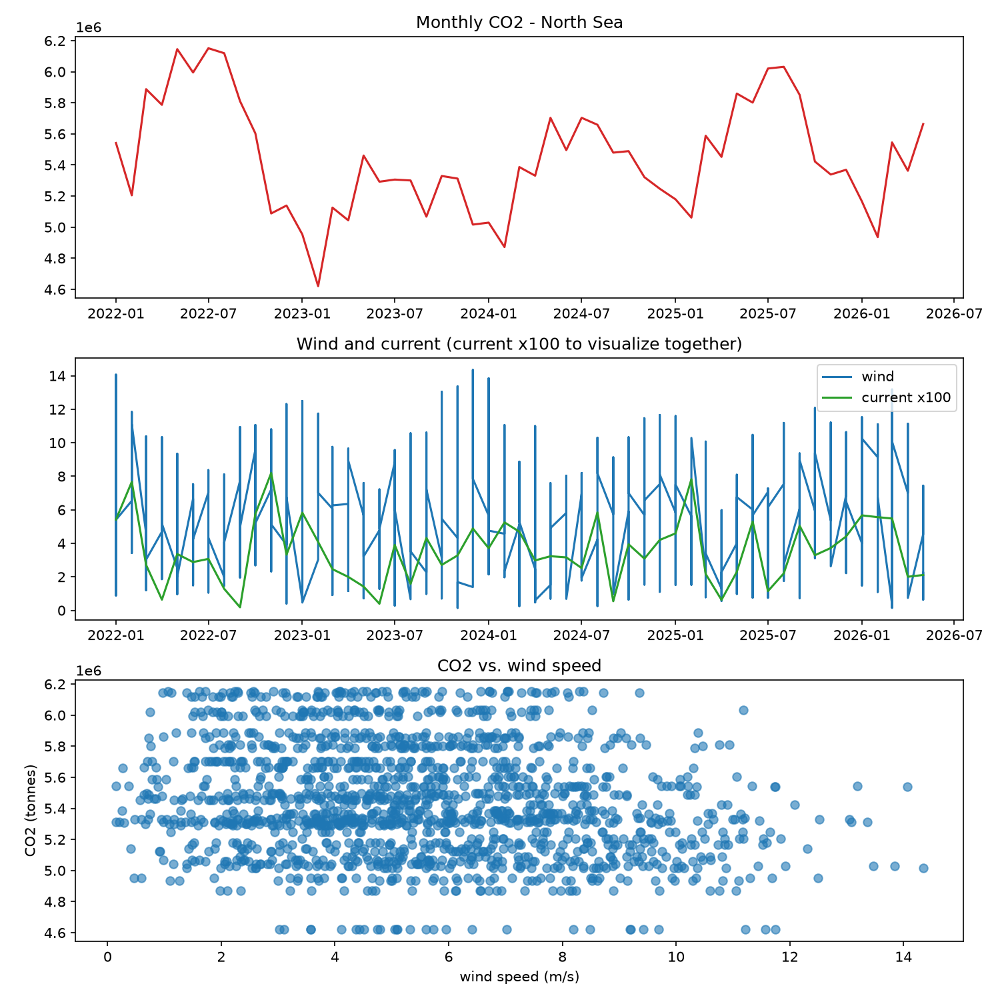
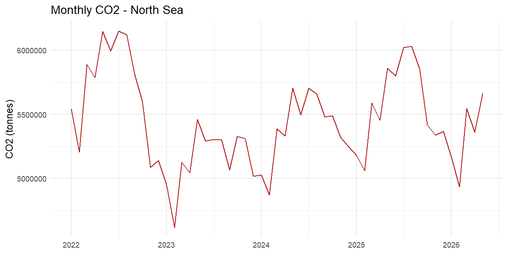
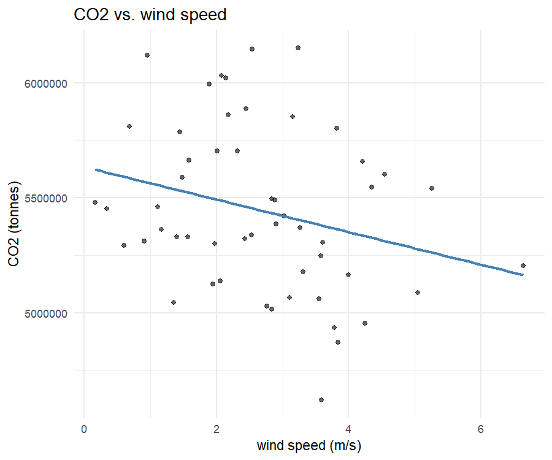
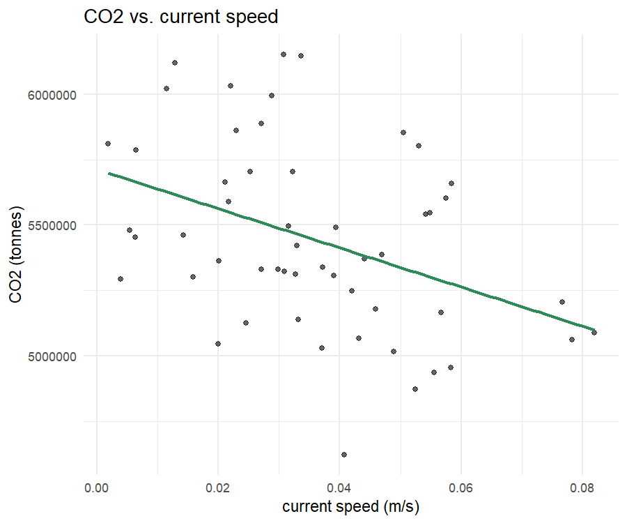
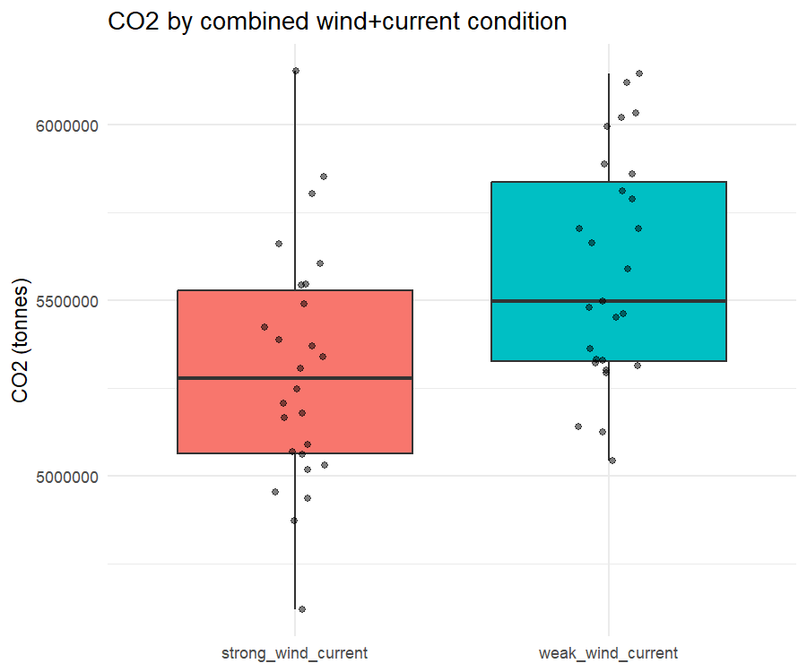

# <h1 align="center">**Maritime Emissions and Environmental Drivers**</h1>

<p align="justify">Fifth project in my oceanographic data series (short title: Ship Emissions and Ocean Currents/Wind Analysis). This one crosses three independent public datasets — ship CO2 emissions, ocean current reanalysis and atmospheric wind reanalysis — to test whether favorable wind and current conditions are associated with lower shipping emissions in a high-traffic maritime region. Unlike the previous projects, this one is built across three languages instead of one: Python for the ETL, SQL for the aggregation/querying layer, and R for the statistical modeling.</p>

**Development environment:** Visual Studio Code (VS Code)

**Project status:** _Completed_ — Python, SQL and R

## Why This Dataset
<p align="justify">This one comes more directly out of my earlier technical background than the others in the series. In shipping construction, weather routing — choosing a course that rides favorable currents and avoids headwinds — is a standard, everyday fuel-saving practice, not a theoretical idea: less resistance means less fuel burned per nautical mile, and less fuel burned means less CO2 per voyage. I'd always taken that relationship for granted as an engineering assumption. This project was my attempt to actually go looking for it in real emissions and reanalysis data, at a regional scale, instead of just assuming it holds.</p>

<p align="justify">That's also why the project ended up being more of a statistics exercise than a data-wrangling one. Three heterogeneous sources — a tabular emissions dataset and two NetCDF reanalysis products (ocean physics and atmosphere) — had to be aligned into one monthly time series first (unit mismatches, daily-vs-monthly resolution mismatches), but the real obstacle turned out to be downstream of that: wind and current move together physically, which breaks a naive regression in a way that took a second technique (PCA) to work around — see <em>What I Did</em> below.</p>

Questions I tried to answer:
<table align="center">
  <tr>
    <th>Question</th>
    <th>Approach</th>
  </tr>
  <tr>
    <td>Do stronger winds correlate with lower shipping CO2 emissions in the region?</td>
    <td>Pearson correlation, monthly time series</td>
  </tr>
  <tr>
    <td>Do stronger ocean currents correlate with lower shipping CO2 emissions?</td>
    <td>Pearson correlation, monthly time series</td>
  </tr>
  <tr>
    <td>Do wind and current independently explain emissions once seasonality is controlled for?</td>
    <td>Multiple OLS regression + VIF multicollinearity check</td>
  </tr>
  <tr>
    <td>If wind and current can't be separated, is there still a combined environmental effect?</td>
    <td>PCA-combined index + median-split group comparison (Welch t-test)</td>
  </tr>
  <tr>
    <td>Which months and countries drive the emissions signal?</td>
    <td>SQL ranking, window functions and quartile analysis</td>
  </tr>
  <tr>
    <td>Is the relationship immediate or delayed, and is it statistically trustworthy over time?</td>
    <td>Lagged vs. same-month correlation; Durbin-Watson autocorrelation test</td>
  </tr>
</table>

## Dataset
<p align="justify">Three sources go into this project: ship emissions (OECD, country/month level), ocean current reanalysis (Copernicus Marine) and atmospheric wind reanalysis (ERA5). A fourth source — a gridded daily global emissions inventory — was evaluated but not used in the final pipeline (see <em>Notes</em> below).</p>

<table align="center">
  <tr>
    <th>Source</th>
    <th>Variable</th>
    <th>Coverage used</th>
  </tr>
  <tr>
    <td><a href="https://www.oecd.org/en/data/datasets/maritime-transport-co2-emissions.html">OECD Data Explorer — Maritime Transport CO2 Emissions</a></td>
    <td>CO2, monthly, by country and vessel type (AIS-based)</td>
    <td>2022-01 to 2026-05, North Sea coastal countries (Netherlands, Belgium, Germany, Denmark, United Kingdom, Norway)</td>
  </tr>
  <tr>
    <td><a href="https://data.marine.copernicus.eu/product/GLOBAL_MULTIYEAR_PHY_001_030/description">Copernicus Marine — GLOBAL_MULTIYEAR_PHY_001_030</a></td>
    <td>Ocean current, <code>uo</code>/<code>vo</code>, NetCDF-4 (same product family as the biogeochemistry project, physics side)</td>
    <td>Monthly means, surface layer, North Sea bounding box</td>
  </tr>
  <tr>
    <td><a href="https://cds.climate.copernicus.eu/datasets/reanalysis-era5-single-levels">Copernicus Climate Data Store — ERA5 reanalysis</a></td>
    <td>10 m wind, <code>u10</code>/<code>v10</code>, NetCDF, via <code>cdsapi</code></td>
    <td>Daily 2014-2026, aggregated to monthly for the North Sea bounding box</td>
  </tr>
  <tr>
    <td><a href="https://doi.org/10.5281/zenodo.11069531">Wen, Y., Xiaotong, W., Tingkun, H., Huan, L., Zhenyu, L., & Kebin, H. (2024). Global shipping emissions for the years 2013 and 2016-2021 [Data set]. Zenodo</a></td>
    <td>0.1°×0.1° daily gridded emissions (CO2, CH4, N2O, NOx, SOx, PM, CO, HC)</td>
    <td>Evaluated, not used in the final pipeline — see <em>Notes</em></td>
  </tr>
</table>

### Study region and time window
<p align="justify">
Bounding box for wind and current: <code>lon -4 to 9, lat 51 to 61</code> (North Sea). Emissions are OECD's country-level aggregate rather than a strict North Sea polygon — the closest available proxy, filtered to <code>VESSEL_EMISSIONS_SOURCE in (TER_DOM, TER_INT)</code> (voyages that physically took place within each country's own territory/waters, as opposed to categories that attribute emissions by the residency of the operating company). Norway and the UK, in particular, have coastline outside the North Sea too, so their totals include some traffic this project's hypothesis doesn't strictly cover.
</p>

<p align="justify">
The three sources only overlap for <strong>53 months</strong> (2022-01 to 2026-05), with 2022 and 2026 as partial-coverage years at either edge of that window — this is why the year-over-year trend later in the project is restricted to the three complete years in between (2023-2025).
</p>

## What I Did
<p align="justify">The pipeline is a sequence of numbered scripts split across three languages, each doing one thing:</p>

<table align="center">
  <tr><th align="center">Step</th><th align="center">Script</th><th align="center">Language</th><th align="center">Purpose</th></tr>
  <tr><td align="center">01</td><td><code>oecd_northsea.py</code></td><td align="center">Python</td><td align="justify">Filter and aggregate OECD emissions to a monthly North Sea series</td></tr>
  <tr><td align="center">02</td><td><code>wind_northsea.py</code></td><td align="center">Python</td><td align="justify">Extract ERA5 wind over the bounding box from the raw NetCDF</td></tr>
  <tr><td align="center">03</td><td><code>combine_and_correlate.py</code></td><td align="center">Python</td><td align="justify">Aggregate wind to monthly, extract current, merge the three series</td></tr>
  <tr><td align="center">04</td><td><code>regression_analysis.py</code></td><td align="center">Python</td><td align="justify">OLS regression + VIF, implemented manually with NumPy/SciPy</td></tr>
  <tr><td align="center">05</td><td><code>load_to_sqlite.py</code> + <code>queries.sql</code></td><td align="center">Python / SQL</td><td align="justify">Load into SQLite; ranking, yearly totals, seasonal profile, moving average and month-over-month change via window functions</td></tr>
  <tr><td align="center">06</td><td><code>regression_analysis.R</code></td><td align="center">R</td><td align="justify">OLS regression + VIF (<code>car</code>), plots (<code>ggplot2</code>) — independent check against step 04</td></tr>
  <tr><td align="center">07</td><td><code>environmental_index.py</code> + <code>environmental_index_queries.sql</code></td><td align="center">Python / SQL</td><td align="justify">Combine wind + current into a single PCA index; median/quartile split in SQL</td></tr>
  <tr><td align="center">08</td><td><code>environmental_index_analysis.R</code></td><td align="center">R</td><td align="justify">Independent PCA check (<code>prcomp</code>), regression on the index, Welch t-test between condition groups</td></tr>
  <tr><td align="center">09</td><td><code>country_and_trend_analysis.py</code> + <code>quality_and_volatility.sql</code></td><td align="center">Python / SQL</td><td align="justify">Per-country correlation with the index, year-over-year trend, data quality checks, per-country volatility (coefficient of variation)</td></tr>
  <tr><td align="center">10</td><td><code>autocorrelation_and_lag.R</code></td><td align="center">R</td><td align="justify">Durbin-Watson test for residual autocorrelation; lagged vs. same-month correlation</td></tr>
</table>

**Wind: vector averaging, not scalar averaging**
<p align="justify">
Wind direction is circular, so daily wind can't be aggregated to monthly by averaging speed directly — the u/v vector components are averaged first, and speed/direction are recomputed from that monthly-mean vector.
</p>

```python
monthly = wind.groupby("TIME_PERIOD", as_index=False)[["u10_mean", "v10_mean"]].mean()
monthly["wind_speed_ms"] = np.sqrt(monthly["u10_mean"] ** 2 + monthly["v10_mean"] ** 2)
monthly["wind_dir_deg"] = (
    180 + np.degrees(np.arctan2(monthly["u10_mean"], monthly["v10_mean"]))
) % 360
```

**Multiple regression, computed manually (NumPy/SciPy)**
<p align="justify">
No <code>statsmodels</code> — the OLS estimator, standard errors and t-tests are built directly from the normal equations, which forces an explicit look at every piece of the output (coefficients, SEs, R², adjusted R²) instead of trusting a library's summary table.
</p>

```python
Xd = np.column_stack([np.ones(len(X)), X])
beta, *_ = np.linalg.lstsq(Xd, y, rcond=None)
resid = y - Xd @ beta
n, k = Xd.shape
sigma2 = (resid @ resid) / (n - k)
cov = sigma2 * np.linalg.inv(Xd.T @ Xd)
se = np.sqrt(np.diag(cov))
tstats = beta / se
pvals = 2 * (1 - stats.t.cdf(np.abs(tstats), df=n - k))
```

**Multicollinearity and the PCA workaround**
<p align="justify">
Wind and current speed turned out to be correlated at <code>r ≈ 0.89</code> — physically expected, since local wind helps drive surface currents — which made it impossible for a multiple regression to separate their individual effect (VIF ≈ 4.98 for both variables, since with only two predictors they share the same VIF). Instead of dropping one variable, they were combined into a single index via PCA.
</p>

```python
w = (df["wind_speed_ms"] - df["wind_speed_ms"].mean()) / df["wind_speed_ms"].std()
c = (df["current_speed_ms"] - df["current_speed_ms"].mean()) / df["current_speed_ms"].std()
Xc = np.column_stack([w, c])
Xc = Xc - Xc.mean(axis=0)
_, S, Vt = np.linalg.svd(Xc, full_matrices=False)
df["env_index"] = np.sign(np.corrcoef(Xc @ Vt[0], df["wind_speed_ms"])[0, 1]) * (Xc @ Vt[0])
```

**Median split in SQL (window functions)**
```sql
WITH ranked AS (
    SELECT TIME_PERIOD, co2_tonnes, env_index,
        PERCENT_RANK() OVER (ORDER BY env_index) AS pct_rank
    FROM monthly_with_index
)
SELECT
    CASE WHEN pct_rank >= 0.5 THEN 'strong_wind_current' ELSE 'weak_wind_current' END AS condition_group,
    ROUND(AVG(co2_tonnes), 0) AS avg_co2,
    COUNT(*) AS n_months
FROM ranked
GROUP BY condition_group;
```

**Group comparison in R (Welch t-test)**
```r
median_idx <- median(df$env_index)
df$condition_group <- ifelse(df$env_index > median_idx, "strong_wind_current", "weak_wind_current")
t.test(co2_tonnes ~ condition_group, data = df)
```

**Residual autocorrelation (Durbin-Watson)**
<p align="justify">
The full regression's residuals were checked for independence before trusting the p-values above — nearby months in a time series are rarely independent, and OLS assumes they are.
</p>

```r
dw_test <- dwtest(co2_tonnes ~ wind_speed_ms + current_speed_ms + month_sin + month_cos, data = df)
```

## Data Quality
<p align="justify">Known data quality issues, checked and documented rather than silently ignored:</p>

<ul>
  <li align="justify">An earlier version of the pipeline merged daily wind directly against monthly emissions <em>before</em> the vector-averaging step above — silently exploding 53 months into 1,612 duplicated rows. The regression run on that unaggregated data produced a misleadingly significant result (multicollinearity artificially diluted, sample size artificially inflated). Caught by asserting the merge stayed at one row per month before trusting any regression output: <code>assert combined["TIME_PERIOD"].is_unique</code>. The <em>Visualisations</em> section below keeps the buggy scatter plot on purpose, as a before/after reference against the corrected R version.</li>
  <li align="justify">Current speed is roughly two orders of magnitude smaller than wind speed (m/s vs. a value an order of magnitude below that) — plotted at ×100 in the combined time-series panel purely to make its shape visible next to wind's, not because the two are on the same physical scale.</li>
  <li align="justify">2022 and 2026 are partial-coverage years in the merged 53-month window (first and last month depend on which of the three sources starts/ends the latest/earliest) — excluded from the year-over-year trend, which is restricted to 2023-2025.</li>
  <li align="justify">The main regression's residuals are autocorrelated (Durbin-Watson ≈ 0.87, p &lt; 0.001) — nearby months are still correlated after removing seasonality, which means the reported p-values are likely more optimistic than they should be. See <em>Limitations</em> for what this does and doesn't undercut.</li>
</ul>

## Visualisations
<p align="justify">
Six plots come out of the pipeline — three from the Python regression step (<code>04</code>), three from the R steps (<code>06</code> and <code>08</code>) that independently re-derive the same relationships. Running the analysis twice, in two different languages, turned out to also be a built-in way of catching a data issue in one version that the other didn't have — see the note on the bottom panel below.
</p>

**Python — regression step**
<p align="center">
  
</p>

<p align="justify">
The top panel is the raw shape of the target variable: monthly CO2 swings between roughly 4.6 and 6.2 million tonnes with a clear seasonal saw-tooth, riding on top of a slower multi-year wave — a sharp trough in early 2023, a partial recovery through 2024, and a second, higher peak in mid-2025.
</p>

<p align="justify">
<strong>The bottom scatter is worth reading carefully, and not for the reason it first looks like.</strong> It's titled "CO2 vs. wind speed," but the x-axis runs to 14 m/s and the plot is dense with thousands of points arranged in horizontal streaks — far more than the 53 months in the dataset. That's the visual signature of the daily-vs-monthly merge bug described in <em>Data Quality</em> above: this particular figure was generated before the vector-averaging fix, from daily wind values merged directly against each month's single CO2 total, so every month's one CO2 value is repeated across ~30 daily wind readings — hence the horizontal bands. It's kept here deliberately as a before/after reference rather than regenerated, because it's a more honest illustration of the bug than a paragraph describing it in the abstract: compare it directly against the clean, 53-point R version two plots down, which uses the correctly monthly-aggregated wind.
</p>

**R — independent replication**
<p align="center">
  
</p>

<p align="justify">
Rebuilding the CO2 series natively in R and plotting it with <code>ggplot2</code> reproduces the Python top panel exactly, peak for peak and trough for trough — a useful sanity check that the two languages are reading the same underlying <code>monthly_combined</code> table, not two subtly different ones.
</p>

<p align="center">
  
  
</p>

<p align="justify">
These are the plots to actually judge the two correlations by — 53 points each, one per month, wind capped at its real monthly-aggregated range of 0-6.6 m/s rather than the daily 0-14 m/s in the Python figure above. Side by side, the current scatter's downward trend line is visibly steeper than the wind one, consistent with current speed's stronger simple correlation (r ≈ -0.40 vs. r ≈ -0.26). Neither fit is tight — both scatters show plenty of vertical spread at any given x-value — which is the visual version of "weak but real": real enough to be statistically significant for current, not tight enough to trust either variable alone once they have to share a regression with each other.
</p>

<p align="justify">
The clearest single plot for the project's headline finding is the boxplot comparing CO2 between strong- and weak-condition months, built from the combined PCA index rather than from wind or current individually:
</p>

<p align="center">
  
</p>

<p align="justify">
The two boxes' medians sit about 250,000 tonnes apart, and — more tellingly than the medians — their interquartile boxes barely overlap, even though the whiskers (and a few individual points) do. That's the PCA index doing exactly what it was built for: a single combined variable separates the two groups more cleanly than either wind or current manages alone in the scatterplots above, which is the visual counterpart to the Welch t-test's p ≈ 0.0035.
</p>

## Database Structure
<table align="center">
  <tr><th align="center">Table</th><th align="center">Rows</th><th align="center">What's in it</th></tr>
  <tr><td align="center"><code>monthly_combined</code></td><td align="center">53</td><td align="justify">Monthly CO2, wind speed, current speed for the North Sea bounding box (2022-01 to 2026-05)</td></tr>
  <tr><td align="center"><code>monthly_with_index</code></td><td align="center">53</td><td align="justify">Same as above, plus the PCA-combined <code>env_index</code></td></tr>
  <tr><td align="center"><code>emissions_by_country</code></td><td align="center">324</td><td align="justify">Monthly CO2 per North Sea coastal country (53 months × 6 countries, minus one partial gap)</td></tr>
</table>

## Output Files
<table align="center">
  <tr><th align="center">File</th><th align="center">Description</th></tr>
  <tr><td align="center"><code>era5_northsea_monthly_wind.csv</code></td><td align="justify">Daily ERA5 wind extracted over the bounding box (u10/v10, speed, direction) before monthly aggregation</td></tr>
  <tr><td align="center"><code>oecd_northsea_monthly_co2.csv</code></td><td align="justify">Monthly OECD CO2, North Sea total (53 months)</td></tr>
  <tr><td align="center"><code>oecd_northsea_monthly_co2_by_country.csv</code></td><td align="justify">Same, broken out per country (324 rows)</td></tr>
  <tr><td align="center"><code>northsea_monthly_combined.csv</code></td><td align="justify">CO2 + wind + current merged to one row per month</td></tr>
  <tr><td align="center"><code>northsea_monthly_combined_with_index.csv</code></td><td align="justify">Same, plus the PCA-combined <code>env_index</code></td></tr>
  <tr><td align="center"><code>northsea_project.db</code></td><td align="justify">SQLite database loaded from the two CSVs above, used for all SQL steps</td></tr>
  <tr><td align="center"><code>northsea_analysis_plots.png</code></td><td align="justify">3-panel Python figure: CO2 time series, wind/current time series, CO2 vs. wind scatter</td></tr>
  <tr><td align="center"><code>northsea_co2_timeseries.png</code>, <code>northsea_co2_vs_wind.png</code>, <code>northsea_co2_vs_current.png</code>, <code>northsea_co2_by_condition_group.png</code></td><td align="justify">R/<code>ggplot2</code> plots — independent reproduction of the time series, both scatters, and the condition-group boxplot</td></tr>
</table>

## Results
<p align="justify">
Simple correlations point the expected way but are weak to moderate, and a plain multiple regression can't confirm either variable individually once they're forced to share one model with each other:
</p>

<table align="center">
  <tr><th align="center">Test</th><th align="center">Result</th><th align="center">Reads as</th></tr>
  <tr><td align="center">CO2 vs. wind speed (Pearson)</td><td align="center">r ≈ -0.26, p ≈ 0.056</td><td align="justify">Weak, borderline significant on its own</td></tr>
  <tr><td align="center">CO2 vs. current speed (Pearson)</td><td align="center">r ≈ -0.40, p ≈ 0.0033</td><td align="justify">Moderate, clearly significant on its own</td></tr>
  <tr><td align="center">Wind vs. current (Pearson)</td><td align="center">r ≈ 0.89, VIF ≈ 4.98</td><td align="justify">Too collinear to separate in one regression</td></tr>
  <tr><td align="center">Multiple regression: wind (co2 ~ wind + current + seasonality)</td><td align="center">p ≈ 0.25</td><td align="justify">Not significant once current competes for the same variance</td></tr>
  <tr><td align="center">Multiple regression: current (co2 ~ wind + current + seasonality)</td><td align="center">p ≈ 0.21</td><td align="justify">Not significant once wind competes for the same variance</td></tr>
  <tr><td align="center">R²: seasonality only → + wind & current</td><td align="center">0.456 → 0.474</td><td align="justify">Two extra variables add under 2 points of R² once seasonality is already in the model</td></tr>
  <tr><td align="center">PCA-index Welch t-test (strong vs. weak months)</td><td align="center">t ≈ -3.06, p ≈ 0.0035</td><td align="justify">Significant once wind + current are combined into one index</td></tr>
  <tr><td align="center">Same-month vs. one-month-lagged correlation</td><td align="center">r ≈ -0.36 (p ≈ 0.0097) vs. r ≈ -0.27 (p ≈ 0.056)</td><td align="justify">Effect tracks current conditions, not last month's</td></tr>
</table>

<p align="justify">
Combining wind and current into a single PCA index (94.7% of their shared variance) resolves the multicollinearity problem. Splitting the 53 months at the index's median gives 26 "strong wind+current" months averaging <strong>~5,303,947 t</strong> CO2, against 27 "weak" months averaging <strong>~5,583,719 t</strong> — about 5% lower. The result was reproduced independently with a second PCA computed natively in R (<code>prcomp</code>), which matched the Python result exactly (up to an arbitrary sign flip).
</p>
<p align="justify">
The effect isn't uniform across countries. Correlating each country's own emissions with the combined index shows Norway (r ≈ -0.38, p ≈ 0.005), Germany (r ≈ -0.33, p ≈ 0.015) and the Netherlands (r ≈ -0.29, p ≈ 0.035) are significant, while the UK (r ≈ -0.22, p ≈ 0.12), Belgium (r ≈ -0.15, p ≈ 0.29) and Denmark (r ≈ -0.09, p ≈ 0.54) are not — plausibly because Norway and Germany have more North Sea shipping exposed to open water, while Belgium and Denmark's traffic runs through more sheltered ports. Norway is also the most volatile country month-to-month (coefficient of variation 0.119), Germany the most stable (0.072). Total regional CO2 fell <strong>9.7%</strong> from 2022 to 2023 (~68.5M → ~61.8M tonnes), then rose <strong>4.7%</strong> and <strong>3.5%</strong> in 2024 and 2025 respectively — not a steady trend in either direction.
</p>
<p align="justify">
Emissions also have a clear seasonal shape independent of wind and current: the seasonal-profile query shows the lowest average month is February (~4.94M t, also the windiest month at ~4.28 m/s on average) and the highest is July (~5.80M t, calmer at ~2.82 m/s). The five highest-emission individual months are all July/August of 2022 or 2025 (6.02-6.15M t each), and the five lowest are all winter months (February 2023, 2024 and 2026 among them, down to 4.62M t in February 2023) — winter's stronger winds don't translate into lower winter emissions, which is exactly why seasonality has to be controlled for separately rather than assumed to be the same thing as the wind/current effect.
</p>
<p align="justify">
A lag test (does last month's conditions predict this month's emissions better than this month's own conditions?) found no evidence of a delayed effect: the same-month correlation is stronger than the one-month-lagged correlation. The relationship tracks current conditions, not the previous month's.
</p>
<p align="justify">
<strong>Takeaway:</strong> a plain multiple regression with wind and current as separate predictors is misleading here — it hides a real effect behind their mutual correlation. Once combined into one environmental-conditions index, the hypothesis holds up: stronger wind+current is associated with meaningfully and significantly lower shipping CO2 emissions, even after accounting for seasonality — though see the autocorrelation caveat below before taking the p-value at face value.
</p>

## Limitations
<p align="justify">
Emissions are country-level (OECD), not restricted to a North Sea shipping-lane polygon — a country like Norway or the UK has coastline outside the North Sea too. Only 53 months of overlapping data were available across all three sources (2022-01 to 2026-05), with 2022 and 2026 as partial-coverage years at either edge of that window — which is why the year-over-year trend above is restricted to the three complete years in between (2023-2025). And because this is observational, monthly-aggregated data, the result is an association, not a causal test of "favorable conditions reduce fuel burn" at the level of individual voyages.
</p>
<p align="justify">
<strong>The regression's residuals are autocorrelated.</strong> A Durbin-Watson test on the main model's residuals returned <strong>DW ≈ 0.87 (p &lt; 0.001)</strong> — well below the 2.0 expected under independence, meaning nearby months are still correlated after removing seasonality (a high-traffic month tends to be followed by another one). This is a genuine violation of the OLS independence assumption for time series data: it means the reported p-values (including the t-test's p ≈ 0.0035) are likely more optimistic than they should be. The direction and rough size of the effect are still informative, but the exact significance levels shouldn't be taken at face value without a model that accounts for the autocorrelation (e.g. Newey-West standard errors or an ARIMA-type error structure) — left as a next step.
</p>

## Tools
**Programming and Development**
- Python
- SQL
- R
- Visual Studio Code (VS Code)

**Python Libraries**
- Xarray
- Pandas
- NumPy
- SciPy
- Matplotlib

**R Libraries**
- dplyr
- car
- ggplot2
- lmtest

**Database**
- SQLite

**Data Format**
- NetCDF
- CSV

## Skills Demonstrated
<p align="center"><i>Python - Xarray - NetCDF Processing - Vector Averaging - SQL - Window Functions - OLS Regression - Multicollinearity Diagnostics (VIF) - PCA - Hypothesis Testing - Autocorrelation Diagnostics - R - Statistical Analysis - Data Visualisation - Data Quality Control - Oceanographic Data</i></p>

## Notes
<p align="justify">
<strong>Why weather routing is more than an engineering assumption.</strong> Voyage/weather routing — planning a track that avoids adverse currents and headwinds — is standard commercial practice specifically because it cuts fuel burn, and fuel burn is the single biggest cost and emissions lever a vessel operator controls voyage-to-voyage; it's also one of the levers the shipping industry is actively leaning on to meet IMO decarbonization targets. That's the practical backdrop for this project's hypothesis: if routing around favorable conditions genuinely reduces fuel consumption at the individual-voyage level, it should leave some trace in regional emissions data once enough voyages are aggregated — which is what the PCA-index result above is evidence for, weak and confounded by seasonality as that trace turns out to be.
</p>
<p align="justify">
The gridded daily emissions dataset (Wen et al. 2024) was the original plan for this project — it would have allowed confining emissions to an actual shipping-lane polygon instead of a whole country. It was set aside for this version for a practical reason: each daily file covers the full global 0.1°×0.1° grid (~500 MB per day), and reprocessing enough days to build a multi-year monthly series for one region wasn't feasible within this project's scope. It remains a natural next step, alongside correcting the residual autocorrelation with a proper time-series error structure before treating the current p-values as final.
</p>

## Bibliography
- Wen, Y., Xiaotong, W., Tingkun, H., Huan, L., Zhenyu, L., & Kebin, H. (2024). [Global shipping emissions for the years 2013 and 2016-2021 [Data set]. Zenodo.](https://doi.org/10.5281/zenodo.11069531)
- [OECD Data Explorer — Maritime Transport CO2 Emissions](https://www.oecd.org/en/data/datasets/maritime-transport-co2-emissions.html)
- [Copernicus Marine Service — Global Ocean Physics Reanalysis (GLOBAL_MULTIYEAR_PHY_001_030)](https://data.marine.copernicus.eu/product/GLOBAL_MULTIYEAR_PHY_001_030/description)
- [Copernicus Climate Data Store — ERA5 hourly data on single levels from 1940 to present](https://cds.climate.copernicus.eu/datasets/reanalysis-era5-single-levels)
- [IMO — 2023 IMO Strategy on Reduction of GHG Emissions from Ships](https://www.imo.org/en/OurWork/Environment/Pages/2023-IMO-Strategy-on-Reduction-of-GHG-Emissions-from-Ships.aspx)

## Author
### Mariana Gomes de Andrade Silva

<p align="center"><strong>Interests: Oceanography - Scientific Programming - Data Analysis - Environmental Data</strong></p>


